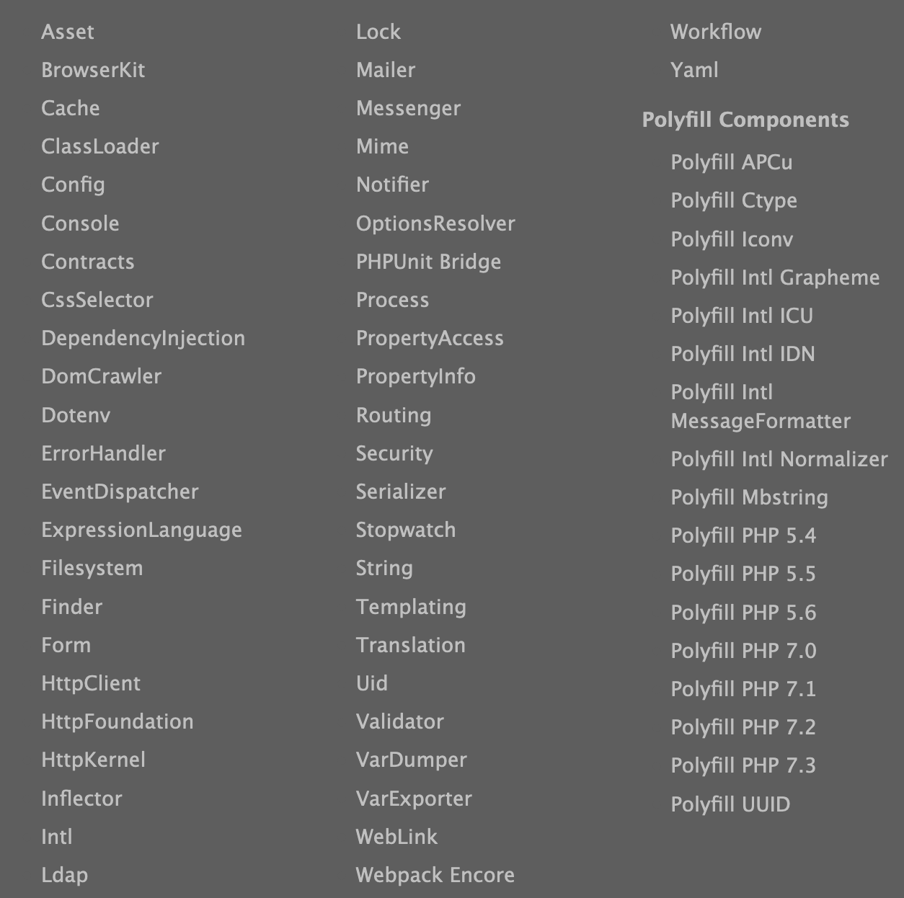

# Introduction : Le framework Symfony
::: doc
Cet excellent article sur les bases de HTTP et du fonctionnement de Symfony :
[https://symfony.com/doc/current/introduction/http_fundamentals.html](https://symfony.com/doc/current/introduction/http_fundamentals.html) 
:::
## Qu'est-ce que Symfony
[Symfony](https://symfony.com) est un framework PHP basé sur une architecture MVC créé en 2005 par Fabien Potencier. 
Il est maintenu et distribué par la société parisienne Sensio Labs.
	
Framework HTTP centré sur un kernel (noyau) => Kernel.php, et la notion de requête/réponse.
 
Il se compose de plusieurs librairies indépendantes les unes des autres résolvant chacune une problématique liée au développement 
d’applications web : Routing (correspondance entre une URL et un contrôlleur), accès et manipulation de bases de données (via l’ORM Doctrine), 
gestion des formulaires, sécurité, mails, queues de messageries, i18n...

Les versions récentes de Symfony (àpd 4.0) nous permettent de ne plus installer le framework dans une version monolithique `
(incluant l’ensemble des composants qu’une application web contient traditionnellement) 
mais plutôt avec une philosophie “micro-framework” : n’installer que les composants nécessaires au fonctionnement de 
notre application (ex: si l’application n’utilise pas de formulaires ou de templates html, l’installation des librairies est facultative).

Cette approche permet de conserver une application aussi légère que possible, d’améliorer les performances (vitesse de chargement, impact sur la mémoire) et d’éviter les failles de sécurité qui pourraient exister dans des composants qui ne sont pas utilisés.

## Les composants du framework Symfony
::: doc
[https://symfony.com/doc/current/components/index.html](https://symfony.com/doc/current/components/index.html)
:::

Symfony n'est donc pas un logiciel monolithique. C'est une aggrégation de plusieurs bibliothèques
apportant chacune des solutions à une problématique liée au développement d'applications web.

Symfony, en tant que framework, propose une implémentation possible permettant d'intégrer et de faire interagir les différents composants.

En tant que développeur de bibliothèque open source, et communauté, Symfony fournit des outils et se charge de la maintenance et de l'évolution de ceux-ci.
Fin avril 2020, Symfony annonçait sur [une page dédiée de son site](https://symfony.com/stats/downloads) 
un total près de 4,4 milliards de téléchargements sur [packagist.org](https://packagist.orf)  

La plupart des composants utilisés par le framework Symfony sont développés de manière à les rendre autonomes. 
Il est donc tout à fait possible d'intégrer seulement certaines des briques de Symfony dans des projets de moindre envergure ou pour faire évoluer progressivement un projet existant. 

Bon nombre d’applicatifs PHP renommés utilisent d’ailleurs certaines de ces librairies.

p.ex : Drupal, phpBB, Prestashop, Laravel... (la liste est longue : [https://symfony.com/projects](https://symfony.com/projects))